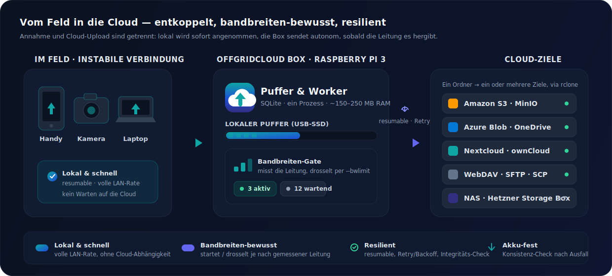
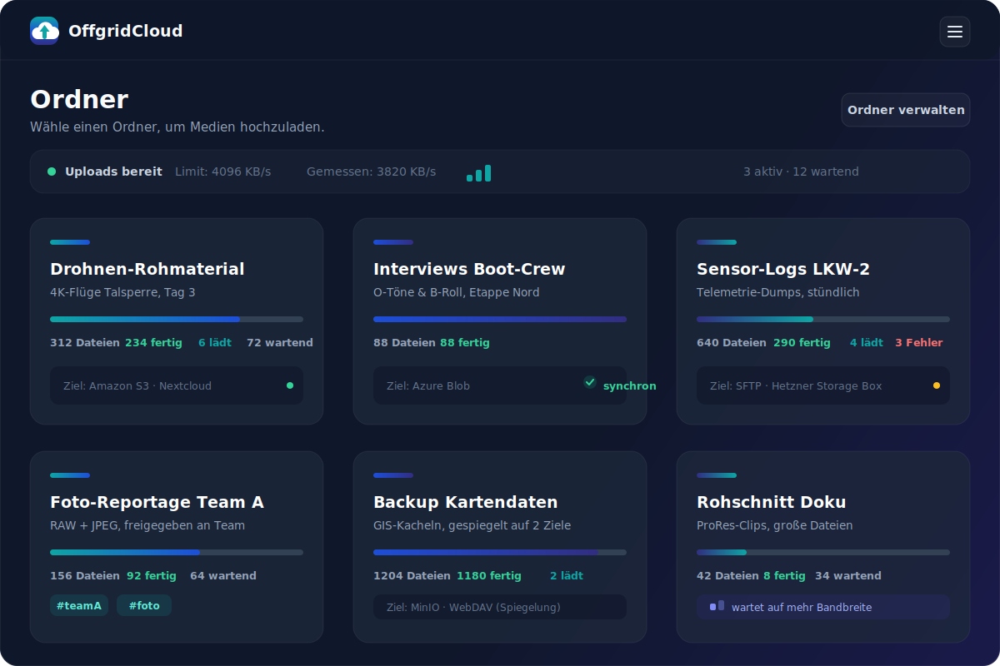
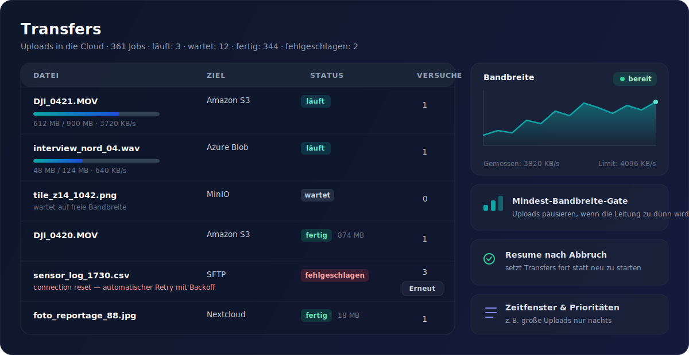

<p align="center">
  
</p>

<p align="center">
  <a href="LICENSE"></a>
  
  
</p>

# OffgridCloud

Ein selbst-gehosteter Mini-Server, der Medien-Uploads aus dem Feld von instabilen
Verbindungen **entkoppelt** und sie zuverlässig in Public-Cloud-Speicher überträgt —
**sobald ausreichend Bandbreite vorhanden ist.**

Ein Team ist mit Auto, Boot oder LKW unterwegs, der Empfang schwankt. Das Feld-Team
lädt alle Medien **lokal und schnell** auf die Box; diese übernimmt den Cloud-Upload
**autonom, bandbreiten-bewusst und resilient** (resumable, mit Retry) und hält den
Status für alle transparent. Sparsam genug für einen **Raspberry Pi 3**.

<p align="center">
  
</p>

## Kernfunktionen

- 📥 **Lokal annehmen, später senden** — Annahme und Cloud-Upload sind entkoppelt
- 📶 **Bandbreiten-bewusst** — Upload startet/drosselt je nach gemessener Leitung (parallele Messung, Ookla-Speedtest-Fallback auf restriktiven Netzen)
- 🔁 **Resilient** — resumable Transfers, automatische Wiederholung, kein Datenverlust
- 🔋 **Akku-fest** — geht die Box (z. B. an der Powerbank) mitten im Upload aus, werden angebrochene Uploads und lokale Kopien beim nächsten Start auf Konsistenz geprüft und torn/korrupte Reste bereinigt
- 🗃️ **Komfortabler Datei-Browser** — Mehrfachauswahl, Löschen mehrerer Dateien auf einmal und Bulk-Download als ZIP
- 👥 **User & Teams** — Admin verwaltet Provider/Ordner; Benutzer laden in freigegebene Ordner (auch per Team-Freigabe)
- ☁️ **Viele Cloud-Ziele** — Amazon S3, MinIO, Azure Blob, OneDrive/SharePoint, Nextcloud, ownCloud, WebDAV, SFTP, SCP/SSH, FTP/FTPS, Hetzner Storage Box, Synology/QNAP/TrueNAS
- 🗂️ **Ordner ↔ Provider** — ein Ordner kann an mehrere Cloud-Ziele gespiegelt werden
- 🏷️ **Tags & Suche** — freie Tags je Medium, ordnerübergreifende Suche/Filter (Dateiname, Tag, Status, Ordner)
- 📝 **Beschreibungen & Themen** — Fotos/Videos thematisch gruppieren und erklären; direkt beim Upload mehrerer Dateien eine Beschreibung mitgeben. Daraus entsteht eine Text-Datei (`.txt`), die automatisch mit in **alle** verknüpften Cloud-Ziele geladen wird
- 📡 **Netzwerk-Redundanz** — fällt der Router aus, hostet die Box ihr eigenes WLAN als Rückfallebene, bis ein hinterlegtes Netz wieder erreichbar ist
- 🔐 **VPN-Client** — wählt sich per WireGuard/OpenVPN ins Heimnetz ein, damit intern-only Ziele (z. B. ein NAS) erreichbar sind
- 🛰️ **Multi-Server-Pool** — mehrere Boxen als Flotte in einer gemeinsamen Übersicht (Knoten, Medien, Transfers, Durchsatz, Speicher)
- 🔔 **Info-Service** — Status-Toasts im UI (Upload fertig, Transfer fertig/fehlgeschlagen), optionale OS-Push-Benachrichtigungen sowie Alerts per Webhook, **Telegram** oder **E-Mail** (inkl. Speicher-knapp-Warnung)
- 🧩 **Modernes Kachel-Dashboard** — Live-Status, Fortschritt, Dark-Mode

---

## Oberfläche

Ein aufgeräumtes Kachel-Dashboard im Dark-Mode — für die Bedienung am Handy im Feld
genauso wie am Laptop. Live-Status über Server-Sent Events, überall Fortschritt und
Ziel auf einen Blick.

<p align="center">
  
  <br>
  <em>Ordner-Dashboard — Fortschritt, Status und Cloud-Ziel je Ordner (Beispieldaten).</em>
</p>

Die Transfer-Ansicht zeigt jeden Cloud-Upload live: Status, Durchsatz, Wiederholungen —
inklusive Bandbreiten-Verlauf und dem Mindest-Bandbreite-Gate, das Uploads pausiert,
wenn die Leitung zu dünn wird.

<p align="center">
  
  <br>
  <em>Transfers &amp; Bandbreite — resumable Uploads, Retry/Backoff und live gemessener Durchsatz (Beispieldaten).</em>
</p>

---

## Installation

## Schnellstart

**One-Liner (empfohlen — Linux / Raspberry Pi OS).** Installiert alle Abhängigkeiten
(git, Node, Python, rclone), baut das Frontend, richtet einen systemd-Dienst ein,
startet ihn und prüft den Health-Endpoint:

```bash
curl -fsSL https://raw.githubusercontent.com/W0rkingChr1s/OffgridCloud/main/deploy/bootstrap.sh | sudo bash
```

Am Ende zeigt der Installer **einmalig** ein zufälliges Admin-Passwort — notieren.
Danach `http://<host-ip>:8000` und Login mit `admin@offgrid.local`.

**Lokal ausprobieren (ohne Installation)** — braucht nur `python3` und `npm`:

```bash
git clone https://github.com/W0rkingChr1s/OffgridCloud.git && cd OffgridCloud
./quickstart.sh                       # http://localhost:8000, Ctrl-C beendet
```

**Docker (ein Image, plattformübergreifend):**

```bash
docker build -f deploy/Dockerfile -t offgridcloud .
docker run -d --name offgridcloud -p 8000:8000 \
  -v /mnt/ssd/offgrid:/data --env-file .env --restart unless-stopped offgridcloud
```

> Weitere Wege (Windows/PowerShell, manuelle Optionen, Deinstallation, Updates) und
> die **Produktiv-Checkliste** (TLS-Reverse-Proxy, Puffer auf USB-SSD, `OGC_SECRET_KEY`
> sichern, Backups, Monitoring) stehen im **[Betriebshandbuch](docs/BETRIEB.md)**.

## Architektur in einem Satz

FastAPI-Backend + **rclone** als universelle Transfer-Engine + bandbreiten-gesteuerter
In-Process-Worker + React/Vite-Kachel-UI (statisch ausgeliefert). Läuft als **ein
Prozess** (nativer systemd-Service oder ein Docker-Image, ~150–250 MB RAM). Details im
**[Konzept](docs/KONZEPT.md)**.

## Entwicklung

```bash
cd backend && python3 -m venv .venv && source .venv/bin/activate
pip install -r requirements-dev.txt
uvicorn app.main:app --reload            # http://localhost:8000
pytest -q && ruff check .                # Tests & Lint

cd frontend && npm install && npm run dev # http://localhost:5173
```

Tests & Lint: `cd backend && pytest -q && ruff check .`. Beiträge:
[CONTRIBUTING.md](CONTRIBUTING.md).

## Status

✅ **Produktionsreif.** Die Phasen 0–8 sind umgesetzt; alle Meilensteine
(**M1** Walking Skeleton → **M4** Feldtauglich) sind erreicht:

- **Phase 0–2** — Grundgerüst, Auth/User-Management, Ordner & **chunked/resumable** lokale Uploads.
- **Phase 3–4** — Cloud-Provider (11 Typen via rclone, Verbindungstest, verschlüsselte Credentials) & automatische **Transfer-Engine** (Retry/Backoff, Resume, Integritäts-Check).
- **Phase 5–6** — **Bandbreiten-Steuerung** (`--bwlimit`, Zeitfenster, Mindest-Bandbreite-Gate, Prioritäten) & **Live-Dashboard** per SSE.
- **Phase 7** — Härtung: Audit-Log, Speicher-Management, Disk-Monitoring, Backup, Reverse-Proxy-Configs, [Betriebshandbuch](docs/BETRIEB.md).
- **Phase 8** — Teams/Gruppen, Thumbnails (Pillow/ffmpeg), PWA fürs Feld, Netzwerk-Redundanz (WLAN-Rückfallebene), VPN-Client (WireGuard/OpenVPN), Multi-Server-Pool, Tags & Suche, Info-Service (Toasts, OS-Push, Webhook/Telegram/E-Mail), Härtung gegen Stromausfall (Integritäts-Checks beim Start, fsync-gesicherte Chunk-Uploads), Datei-Browser mit Bulk-Löschen/-Download, aktive Bandbreiten-Probe (parallele Streams, Speedtest-Fallback).

Der ursprünglich geplante Backlog ist damit vollständig abgearbeitet — siehe
[Entwicklungsplan](docs/ENTWICKLUNGSPLAN.md) für die Historie und die optionale
Phase 9 (Desktop-Client, in Arbeit).
Beiträge willkommen — siehe [CONTRIBUTING.md](CONTRIBUTING.md).

## Dokumentation

Die ausführlichen Anleitungen liegen unter [`docs/`](docs/) (und sind für das
**[Projekt-Wiki](https://github.com/W0rkingChr1s/OffgridCloud/wiki)** aufbereitet):

- 📗 [Betriebshandbuch](docs/BETRIEB.md) — Installation, Absicherung, Betrieb, Troubleshooting
- 📘 [Konzept](docs/KONZEPT.md) — Vision, Architektur, Datenmodell, Tech-Stack
- 📡 [Netzwerk-Redundanz](docs/NETZWERK-REDUNDANZ.md) — WLAN-Rückfallebene bei Router-Ausfall
- 🔐 [VPN-Client](docs/VPN.md) — ins Heimnetz einwählen (WireGuard/OpenVPN)
- 🛰️ [Multi-Server-Pool](docs/MULTI-SERVER-POOL.md) — mehrere Boxen als Flotte
- 💻 [Desktop-Client](docs/CLIENT.md) — Auto-Upload-Agent für macOS/Linux/Windows (Plan)
- 🗺️ [Entwicklungsplan](docs/ENTWICKLUNGSPLAN.md) — Roadmap in Phasen & Meilensteinen

<!--
  There is more here than meets the eye. The old machines never really left.
  If you know the sacred sequence of the gamers of old, the screen remembers:
  up, up, down, down, left, right, left, right, B, A.
-->

## Lizenz

[GPL-3.0](LICENSE)
